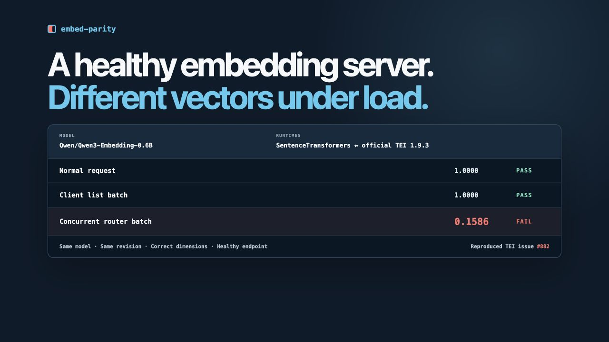

# embed-parity

A healthy embedding server can still return severely different embeddings under
production batching.

The pinned `Qwen/Qwen3-Embedding-0.6B` reproduction compared
SentenceTransformers with official TEI 1.9.3:

```text
Request path                   Minimum cosine
Normal request                    1.0000  PASS
Client list batch                 1.0000  PASS
Concurrent router batch           0.1586  FAIL
```

Same model. Same revision. Correct dimensions. Healthy endpoint. The failure
appeared only when TEI coalesced independent equal-length requests. The proposed
fix restored concurrent parity to `1.0000`.

**embed-parity is a differential testing CLI for catching this class of silent
failure across runtimes, batching modes, prompts, pooling configurations, and
production workloads.**

[](https://kraftaa.github.io/parity-checker/)

The [pinned reproduction](experiments/current/tei-882) includes container
digests, model revision, raw output, and the proposed-fix comparison. The
[interactive explanation](https://kraftaa.github.io/parity-checker/) shows why
client batching passed while concurrent router batching failed.

## Compare a real search workload

When migrating from SentenceTransformers to Hugging Face Text Embeddings
Inference (TEI), bring representative queries and documents and compare the
actual retrieval behavior:

```bash
embed-parity workload \
  --model BAAI/bge-small-en-v1.5 \
  --tei http://localhost:8080 \
  --input search-workload.jsonl \
  --json parity-report.json \
  --html parity-report.html
```

```text
250 queries
4,812 documents

Top-1 agreement      98.8%
Top-5 overlap        99.4%

3 queries changed materially.
```

The report identifies affected queries and shows reference and candidate results
side by side. It calls this behavioral change—not a quality regression—because
workload files do not contain relevance judgments.

## Installation

Python 3.10 or newer is required.

On an Apple-silicon Mac, install the complete runtime with Homebrew:

```bash
brew install kraftaa/tap/embed-parity
```

On other platforms, install from PyPI:

```bash
python -m pip install 'embed-parity[sentence-transformers]'
```

For local development:

```bash
python -m venv .venv
source .venv/bin/activate
pip install -e '.[sentence-transformers,test]'
```

## Usage

Workload JSONL requires a unique `id`, an explicit `query` or `document` type,
and non-empty text. Unknown roles are rejected rather than guessed.

```jsonl
{"id":"q-001","type":"query","text":"postgres query blocked by lock"}
{"id":"d-001","type":"document","text":"How to diagnose PostgreSQL blocking sessions..."}
{"id":"d-002","type":"document","text":"Introduction to Redis caching..."}
```

For large inputs, deterministic role-stratified sampling is enabled by default
at 10,000 documents and 1,000 queries. Set the limits and seed explicitly when
recording a migration artifact:

```bash
embed-parity workload --model org/model --tei http://localhost:8080 \
  --input workload.jsonl --max-documents 10000 --max-queries 1000 --seed 42 \
  --save-baseline baseline.json --html baseline.html
```

Compare a later deployment against that exact sampled workload with
`--baseline baseline.json`. JSON is the canonical machine-readable result; the
HTML file is static, self-contained, and intended for migration reviews and CI
artifacts.

The reproducible BEIR SciFact experiment uses 50 real queries and 500 real
documents. Matching SentenceTransformers and TEI produced 100% top-1, top-5,
and top-10 parity. Adding an unintended TEI default prompt left dimensions and
health intact but changed top-1 agreement to 92.0% and top-5 overlap to 86.4%.
See [`experiments/current/workload-parity`](experiments/current/workload-parity).

### Controlled runtime parity

Start TEI with the same model used by the reference. For example, using the
official TEI container (choose an image tag appropriate to your environment):

```bash
docker run --gpus all -p 8080:80 \
  -v "$PWD/data:/data" \
  ghcr.io/huggingface/text-embeddings-inference:cuda-1.9 \
  --model-id BAAI/bge-small-en-v1.5
```

Use the existing controlled probes to investigate lower-level runtime behavior:

```bash
embed-parity compare \
  --model BAAI/bge-small-en-v1.5 \
  --revision MODEL_COMMIT_SHA \
  --tei http://localhost:8080
```

Write a JSON report and select batch sizes with:

```bash
embed-parity compare \
  --model BAAI/bge-small-en-v1.5 \
  --tei http://localhost:8080 \
  --batch-sizes 1,8,32 \
  --concurrent-requests 4 \
  --concurrency-trials 3 \
  --json report.json
```

The human report prints every default threshold. They are operational defaults,
not universal scientific constants, and every threshold has a CLI flag. Run
`embed-parity compare --help` for the full list. Use `--revision` to pin the
SentenceTransformers side and `--normalize` or `--no-normalize` to make the
reference normalization choice explicit.

To reproduce a failure with your own corpus, provide JSONL objects with a required
`text` and optional `id` and `category`:

```jsonl
{"id":"query-1","category":"query","text":"best waterproof boots"}
{"id":"doc-1","category":"document","text":"These boots use a sealed membrane."}
```

```bash
embed-parity compare --model org/model --tei http://localhost:8080 \
  --probe-file probes.jsonl --lengths 64,128,256,257,512
```

Use `--skip-length-analysis` for a fast corpus-only check. Reports include the
selected batch sizes and lengths plus a SHA-256 fingerprint of the exact corpus.
If `--json` is set, exit-code-2 execution failures also produce a structured JSON
error report.

By default the CLI sends four independent requests simultaneously for three
trials. This exercises TEI's router-coalesced server batching, which is different
from putting several inputs in one client request. Use `--no-concurrency-check`
for rate-limited endpoints, or change `--concurrent-requests` and
`--concurrency-trials` explicitly. The report records both batch mechanisms
separately.

### TEI transport controls

The CLI waits for `/health` before loading the reference model and retries
transient HTTP failures. Relevant options include:

```bash
embed-parity compare --model org/model --tei https://tei.example.com \
  --tei-api-key "$TEI_API_KEY" \
  --tei-header X-Tenant=search \
  --tei-retries 4 \
  --tei-retry-backoff 0.5 \
  --readiness-timeout 60 \
  --no-tei-truncate
```

Set `EMBED_PARITY_TEI_API_KEY` instead of passing the bearer token on the command
line when possible. `HF_TOKEN` is honored by Hugging Face libraries for private
or gated reference models. Authentication values are never written to reports.

Exit codes are:

- `0`: configured parity checks passed
- `1`: a meaningful parity check failed
- `2`: execution or configuration failed

## What is measured

The built-in deterministic corpus contains exactly 100 probes covering short and
paragraph text, semantic and unrelated pairs, queries and documents, code, SQL,
numbers, punctuation, whitespace, Unicode, accented text, six non-English
languages, and empty or near-empty strings. Long probes are separate: they are
created through the reference tokenizer at 32, 64, 128, 256, 384, 512, 768, and
1024 tokens. No LLM is used to generate any probe.

TEI rejects empty and whitespace-only strings. Those probes remain part of the
built-in corpus but are capability-filtered for TEI comparisons and listed under
`skipped_probes` in the report rather than causing an execution failure.

The comparison has four layers:

1. Structural checks validate counts, dimensions, finite values, zero vectors,
   and norm distributions. A dimension mismatch stops similarity analysis.
2. Vector checks report mean, median, minimum, p01, and p05 cross-runtime cosine,
   plus the ten worst probes.
3. Geometry checks compare the upper triangles of pairwise cosine matrices with
   Pearson, Spearman, mean absolute difference, and maximum difference.
4. Neighbor checks measure top-1 agreement and average top-5/top-10 overlap and
   identify the most changed neighborhoods.

Both runtimes are rerun at every requested client-list batch size. The TEI
candidate also receives repeated independent single-input requests concurrently;
the same text is used in every request so equal token length is guaranteed
without guessing the server tokenizer. For E5 and English BGE models, query
probes test model-family-recommended prefixes; E5 document probes
also test `passage: `. This is a diagnostic observation only: the tool says a
prefix *may* explain a difference; it does not claim an unobserved server
configuration as fact.

TEI metadata endpoints vary by server version. The adapter tries `/info` and `/`,
records the complete JSON object, and promotes recognized model, revision, dtype,
dimension, and input-length fields. Known model or revision conflicts fail the
comparison. Unknown fields remain unknown rather than being inferred; a known
dtype difference is diagnostic but does not fail otherwise-equivalent vectors.

## Tests and broken fixtures

```bash
pip install -e '.[dev]'
ruff format --check .
ruff check .
mypy embed_parity
pytest -m 'not integration' --cov
```

The deterministic fake backends and mocked HTTP adapter prove detection of all requested classes:
equivalent output, missing normalization, dimensional mismatch, small noise,
large perturbation, a 256-token truncation boundary, batch dependence, hidden
query prefix, NaN output, an incompatible embedding space, malformed/ragged TEI
responses, wrong response counts, metadata conflicts, and JSONL validation.

## Real-world TEI regression

The pinned experiment in
[`experiments/current/tei-882`](experiments/current/tei-882) reproduces open
[TEI issue #882](https://github.com/huggingface/text-embeddings-inference/issues/882)
with `Qwen/Qwen3-Embedding-0.6B`:

| Request path | Official TEI 1.9.3 | Proposed PR #883 build |
|---|---:|---:|
| Client list batch | 1.0000 | 1.0000 |
| Unequal-length control | 1.0000 | 1.0000 |
| Concurrent router batch | **0.1586** | 1.0000 |

The official server stayed healthy and returned the expected dimensions. The
failure appears only when independent equal-length requests are coalesced. The
patched image is community-built evidence for the proposed fix, not an official
Hugging Face release or production recommendation.

## Baseline experiments

The repository includes an opt-in three-model integration test for:

- `BAAI/bge-small-en-v1.5`
- `intfloat/e5-small-v2`
- `sentence-transformers/all-MiniLM-L6-v2`

Provide three live endpoints and run:

```bash
TEI_BGE_SMALL_URL=http://localhost:8081 \
TEI_E5_SMALL_URL=http://localhost:8082 \
TEI_MINILM_URL=http://localhost:8083 \
pytest -m integration -vv
```

The three models were also run against TEI 1.9.3 on Apple Metal on August 19,
2026 with identical pinned model commit SHAs on both runtimes. All baseline
configurations passed. A real MiniLM negative control with
TEI pooling deliberately changed from `mean` to `cls` failed and was diagnosed
as a known pooling mismatch. See [the experiment report](reports/README.md) and
the machine-readable JSON files in `reports/`.

The `live TEI parity` GitHub Actions workflow runs pinned MiniLM weekly and on
manual dispatch, including the concurrent server-batching check. Tagging `v0.3.0`
builds a GitHub release and publishes to PyPI
through trusted publishing after the repository's `pypi` environment and PyPI
trusted publisher are configured.

## Scope and interpretation

This is not a general backend framework. It contains exactly two production
adapters: SentenceTransformers and TEI. A passing result means the selected probe
suite and thresholds found the runtimes operationally equivalent; it is not a
proof that every possible input will match. Diagnostics intentionally use phrases
such as “possible truncation mismatch” because measurements often narrow the
cause without proving the server's internal configuration.
